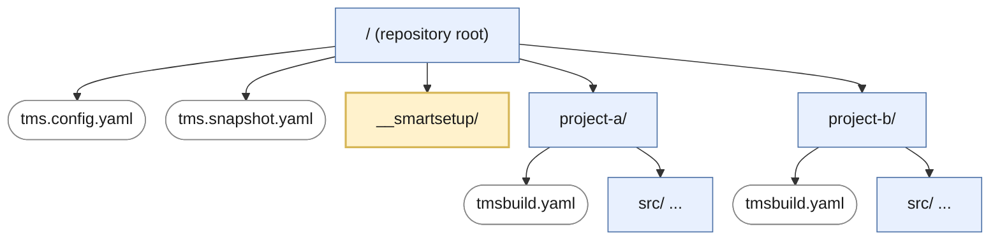
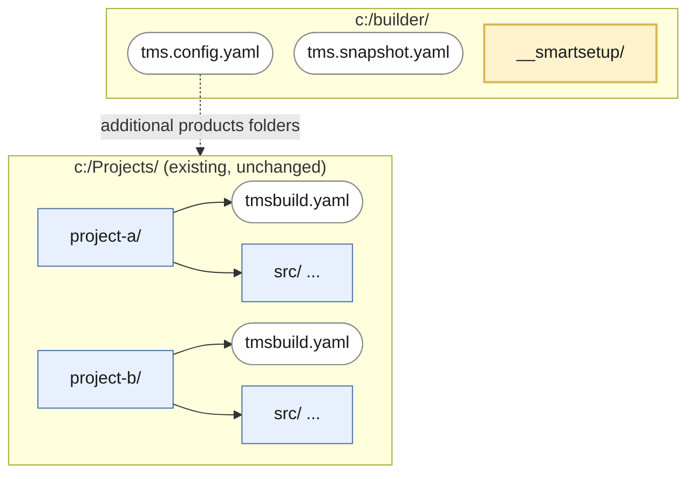
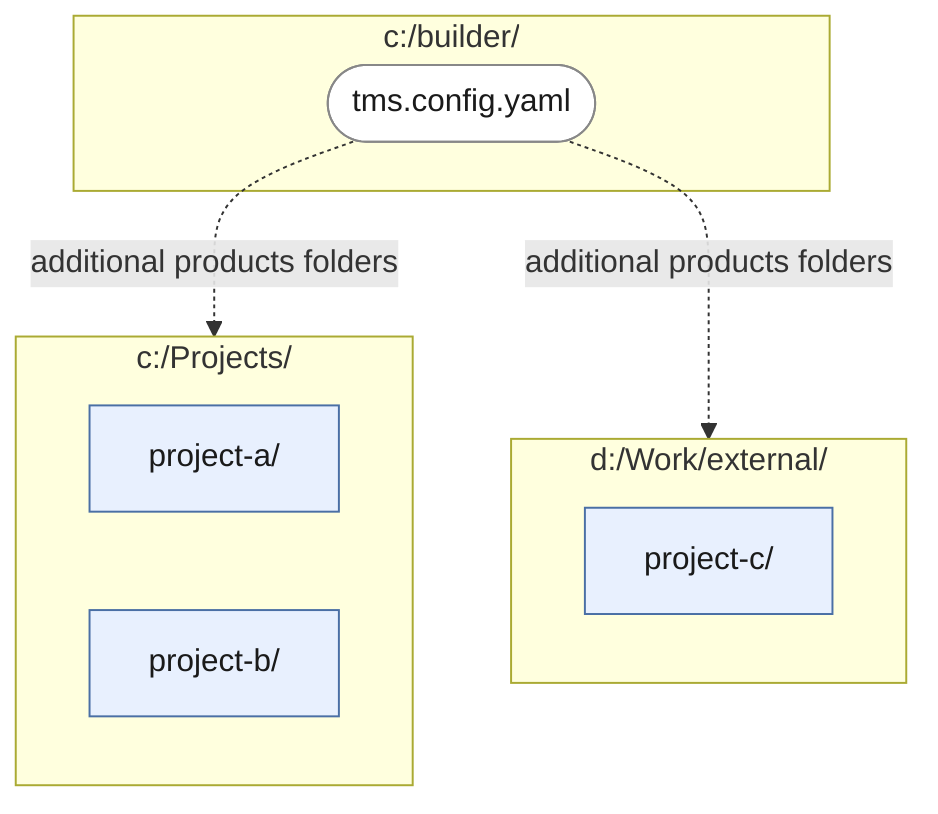

# Using SmartSetup for Automated Builds and in Continuous Integration (CI) environments

SmartSetup is two tools in one: It is a tool that downloads components from a server or a public repository (GitHub, Bitbucket, etc), but it is also a tool that builds Delphi components and full applications. 

In this document we will study how you can use SmartSetup to build your own projects and components in an automated way.

## Advantages of using SmartSetup to build your projects

While you can also use the classic msbuild (and even dcc32.exe) to build your applications, building them with SmartSetup has some advantages.

  * No need to install any components. This is particularly useful in a server or CI environment, because installing a particular version of a component might break other builds running on the same server. If you are building only with SmartSetup, you don't have to worry about modifying Delphi in any way on the server.
  * SmartSetup can build in parallel, taking dependencies into account. So if one of your products depends on Component A, it won't start building until Component A is compiled. But it might start before Component B finishes, if this product doesn't require Component B.
  * Your project becomes aware of its dependencies. If you change Component A, and your project depends (directly or indirectly) on Component A, your project will be recompiled too. If Component B doesn't depend on A, it won't be touched.
  * It is simpler to configure all build parameters from a single `tms.config.yaml`. If you now want to build in Delphi 13 instead of 12, you only need to modify that file, and all components and projects will be built with Delphi 13.

## Making your projects SmartSetup-aware

To make your project build with SmartSetup, you need to generate a `tmsbuild.yaml` file in its root folder. 
The simplest way to do this is to cd to the root folder, and type:
```
tms spec
```
[tms spec](xref:SmartSetup.Command.Spec) will ask you a few questions, and try to create a `tmsbuild.yaml` file for you. You can then edit that file and change it to your needs.

{{#Tip}}
If you edit the file with Visual Studio Code and the YAML extensions installed, you will get error highlighting and autocomplete. We provide a [schema for the file](https://github.com/tmssoftware/smartsetup/blob/main/tms/example-config/tmsbuild.schema.json) so any editor that can understand that schema should be able to help.
{{/Tip}}

Or, if you prefer, you can [download a fully empty `tmsbuild.yaml`](https://github.com/tmssoftware/smartsetup/blob/main/tms/example-config/tmsbuild.yaml) and modify it, without using `tms spec`. 

You can find more information about editing this file [in the docs](xref:SmartSetup.CreatingBundles)
And you can see an example of an app adapted to build with SmartSetup here: https://github.com/agallero/multide  
This particular example doesn't depend on any components, but it can give you an idea of how to organize it.

## Configuring the build

### Recommended folder structure

The simplest way to use SmartSetup in CI is to place a `tms.config.yaml` at the root of the repository, keep each of your existing projects in its own subfolder with a `tmsbuild.yaml` inside, and reserve a `__smartsetup` subfolder at the root for all files generated by SmartSetup (logs, compiled packages, downloaded components, etc). You should have a snapshot `tms.snapshot.yaml` at the root too. Put both `tms.config.yaml` and `tms.snapshot.yaml` into version control, but add the `__smartsetup` folder to gitignore.  



With this layout, `tms.config.yaml` describes how *every* project in the repository must be built, while each `tmsbuild.yaml` describes the shape of a single project (its packages, platforms, dependencies, etc). SmartSetup automatically picks up every project under the root, so you don't need to list them explicitly.

{{#Tip}}
We suggest using the same convention as here: a `__smartsetup` folder directly below the root for all tms working files, which should be added to gitignore. In the future, tools might automatically detect that name if we all use the same one. But you can of course use any name you like. Still, there are two restrictions to consider:
  * The folder can have any name, but it can't start with a dot, like in `.smartsetup`. This is a limitation in Embarcadero's BRCC32 compiler, which crashes and generates empty resources if any folder in the path starts with a dot. SmartSetup will raise an error if you try to use a folder starting with a dot.
  * Because we use hard links, the `__smartsetup` folder must be on the same disk as the rest of the projects. Again, SmartSetup will tell you if you try to use different disks. 
{{/Tip}}

To make this structure work well in CI, two settings in `tms.config.yaml` are important:

- **`skip register: true`** — prevents SmartSetup from registering the built packages in any installed IDE. On a CI server you rarely want to modify Delphi's global state, and this also avoids failures on machines that don't have Delphi installed in the usual locations.
- **`working folder: __smartsetup`** — redirects all files that SmartSetup generates (logs, compiled output, downloaded components, intermediate files) to the `__smartsetup` subfolder instead of scattering them around the repository root. This keeps the working tree clean and makes it trivial to wipe the output with a single `rm -rf __smartsetup`.

A minimal `tms.config.yaml` following this convention looks like:

```yaml
tms smart setup options:
   working folder: __smartsetup

configuration for all products:
   options:
      skip register: true
```
{{#Tip}}
You can also put the `__smartsetup` folder outside the folders if you don't want to have to add it to .gitignore. Just use a working folder like `..\__smartsetup` or `c:\temp\__smartsetup`.
{{/Tip}}


{{#Tip}}
If you want different settings for CI than for normal building, you can store the CI settings in a different file, like `tms.config.ci.yaml`, and then call `tms build -config:tms.config.ci.yaml`. See [Global Options](xref:SmartSetup.Command.GlobalOptions)
{{/Tip}}

### Alternative: using an external builder folder

Sometimes you can't (or don't want to) drop a `tms.config.yaml` at the root of an existing repository. The layout might be fixed by another tool, the projects might live in several repositories, or you might simply want to keep build configuration separate from source code.

In that case, create a dedicated *builder folder* anywhere on disk. This folder plays the same role as the repository root in the previous section: it holds `tms.config.yaml`, `tms.snapshot.yaml`, and its own `__smartsetup/` subfolder for generated files. Your existing projects stay exactly where they are, untouched. As before, `tms.config.yaml` and `tms.snapshot.yaml` should be in version control, but the `__smartsetup` folder should be gitignored.

The link between the builder folder and your projects is the **`additional products folders`** setting. Each entry points to a folder where SmartSetup should look for projects. SmartSetup walks each entry recursively, so you only need one entry per *root* that contains projects, not one per project. If `project-a` and `project-b` both live under `c:\Projects`, a single entry `c:\Projects` is enough to pick up both.



If your projects live under several unrelated roots, add one entry per root:



A `tms.config.yaml` for this setup looks like:

```yaml
tms smart setup options:
   working folder: __smartsetup
   additional products folders:
      - c:\Projects
      - d:\Work\external

configuration for all products:
   options:
      skip register: true
```

{{#Tip}}
You can also set the list from the command line, without editing the file by hand:

```shell
tms config-write -p:"tms smart setup options:additional products folders = [c:\Projects, d:\Work\external]"
```

See [the `-p` parameter](#-p-command-to-pass-a-configuration-to-tms) for the full syntax.
{{/Tip}}

### Global options and machine-dependent options

Sometimes, you might want to have some configuration options (like paths) that vary from machine to machine. You can do this by adding an extra `tms.config.local.yaml` to the root folder and adding it to `.gitignore`, or specifying one with [-add-config](xref:SmartSetup.Command.GlobalOptions).

See [below](#adding-extra-settings-to-an-existing-configuration-file) for more information.

## Snapshots

In order to retrieve the exact same versions of all the components used, you need to save a [snapshot](xref:SmartSetup.Versioning#snapshots) of all the components and versions you are developing with at the root. You can create this file manually or automatically, and you should have it in version control so it can be checked out in the build server.

## Building

Once you have the structure, configuration files and snapshots, the steps to build should be:

1. Clone the repo (or pull the changes) in the build server. Note: if you are using an [external builder folder](#alternative-using-an-external-builder-folder), you will need to clone all the repos, including the `builder` folder, and keep the structure. 
2. Restore the snapshot with `tms restore -skip-register snapshot.yaml`. This will ensure the correct versions of everything are used, and will build all your projects.


## Advanced: Automating command calls

When creating scripts to automate a build, the following commands might come handy:


### `-json` parameter, to get the results in a JSON object instead of plain text

For example:
```shell
tms list -json
tms list-remote -json
tms credentials -print -json
tms info -json
tms server-list -json
tms config-read -json
```

### `-p` command, to pass a configuration to tms 

Our configuration is normally done in `tms.config.yaml`. This allows all your settings to be in a single version-controlled file. 
But sometimes, you might want to call tms with some specific configuration, but not alter the existing `tms.config.yaml`.
In those cases, you can use the "-p" parameter to override any property in `tms.config.yaml`

The rules are: 
 1. Look at the path for the property in tms.config.yaml. Say we want to change the skip-register setting: it is under `configuration for all products`, then `options`, then `skip register`
 2. Replace the spaces with "-" signs. *Note: This step is optional. You can still write the names with spaces, but you will need to quote them so the command line accepts them*.
 3. Join the sections with ":"
 4. If the variable you want to set is an array (like, for example, the delphi versions), you set it by putting the elements between brackets and separating them with commas. For example: [delphi11,delphi12]. You can specify if you want to add those values to the existing array or replace the existing array by prepending `add-` or `replace-` to the name of the property. If the property is "delphi-versions", you can set "add-delphi-versions" instead to add to the existing values. ("replace" is the same as writing nothing, but we have the option so you can be more explicit in what you want to do)

 Some examples (the first and the second are similar, but the second omits step 2 above):

```shell
tms build -p:configuration-for-all-products:options:skip-register=true
tms build -p:"configuration for all products:options:skip register=true"
tms build -p:configuration-for-all-products:replace-platforms=[win32intel,win64intel] -p:configuration-for-all-products:replace-delphi-versions=[delphi12]
```

{{#Tip}}
Sometimes it might not be easy to figure out the exact syntax to change a setting. **But there is a simple way**.
[tms config-read](xref:SmartSetup.Command.ConfigRead) has a parameter: `-cmd`, which will list all the existing configuration options with the syntax `-p` uses.  So for example, you would do:

```
tms config-read -cmd
```
And get this result:
```
-p:"tms smart setup options:build cores = 0"
-p:"tms smart setup options:alternate registry key ="
-p:"tms smart setup options:working folder ="
-p:"tms smart setup options:prevent sleep = true"
-p:"tms smart setup options:versions to keep = -1"
-p:"tms smart setup options:error if skipped = false"
-p:"tms smart setup options:excluded products = []"
-p:"tms smart setup options:included products = []"
-p:"tms smart setup options:additional products folders = []"
-p:"tms smart setup options:auto snapshot filenames = [tms.snapshot.yaml]"
-p:"tms smart setup options:servers:tms:enabled = true"
-p:"tms smart setup options:servers:community:enabled = true"
...
```

So, if you wanted to change the autosnapshot filenames to save to two places, you can just copy from the results above and modify them:
```
tms config-write -p:"tms smart setup options:auto snapshot filenames = [tms.snapshot.yaml, ../../tms.snapshot.yaml]"
```
{{/Tip}}

### Adding extra settings to an existing configuration file.

As mentioned before, if you have an existing configuration, but you want to temporarily change a value, you can do it with `-p`. But if there are many `-p` parameters, the command line might become too complex. An alternative, which is 100% equivalent, is to use the `-add-config` command.

Let's say you have an existing configuration, but you now want to build in a CI server, so you don't want to register any component.

You could do it with:
```
tms build -p:"configuration for all products:options:skip register = true"
```
But you can also create a CI config file, let's call it `tms.ci-config.yaml`. Inside that file you can have just the lines:
```yaml
configuration for all products:
   options:
      skip register: true
```
And then call 
```
tms build -add-config:tms.ci-config.yaml
```
This will have the same effect as the `-p` line above, but it might be simpler to maintain. You can also add multiple configs:
```
tms build -add-config:tms.ci-config.yaml -add-config:tms.delphi12-config.yaml
```
The line above will load the configuration in `tms.config.yaml`, then apply the changes in `tms.ci-config.yaml` and finally apply the changes in `tms.delphi12-config.yaml`.

{{#Note}}
The same rule 4 in [the section about -p](#-p-command-to-pass-a-configuration-to-tms) applies here. If you are replacing an array, you can use `add ` or `replace ` prefixes to control the behavior:

If the original tms.config.yaml had delphi11 as the delphi version, then adding this config:

```yaml
configuration for all products:
   add delphi versions:
    - delphi12
    - delphi13
```
will add delphi12 and delphi13 to the existing ones, resulting in `delphi versions=[delphi11, delphi12, delphi13]`

On the other hand, if you add this configuration:
```yaml
configuration for all products:
   replace delphi versions:
    - delphi12
    - delphi13
```
it will replace [delphi11] array with the new one, and the result will be `delphi versions=[delphi12, delphi13]`

{{/Note}}

{{#Tip}}
Since SmartSetup 3.2, you can also create a file named `tms.config.local.yaml` and this file will be automatically added to your config, as if you had specified `-add-config:tms.config.local.yaml`. But if you use that specific name, you won't need to add the `-add-config` parameter to every call — it will be loaded automatically.
{{/Tip}}

### `tms config-read` and `tms config-write` to read and change tms.config.yaml
These two commands allow you to read or update a setting from `tms.config.yaml`. Unlike the `-p` parameter, [tms config-write](xref:SmartSetup.Command.ConfigWrite) will modify the actual file. This can be useful, for example, when building a GUI: you can use [tms config-read](xref:SmartSetup.Command.ConfigRead) to read a value from the config file and show it to the user. When the user modifies it, you can use [tms config-write](xref:SmartSetup.Command.ConfigWrite) to write it back.

The syntax for specifying the setting to read or write is the same as the one in the `-p` parameter above. In fact, [tms config-write](xref:SmartSetup.Command.ConfigWrite), when called alone, just reads your settings and writes them back, reformatting the config file. You need to use the `-p` parameter to alter that configuration, so what is written is different from the existing settings.

Examples:
```shell
tms config-read configuration-for-all-products:delphi-versions
tms config-write -p:configuration-for-tms.flexcel.vcl:replace-platforms=[] -p:tms-smart-setup-options:prevent-sleep=false -p:tms-smart-setup-options:git:git-location="" -p:configuration-for-all-products:replace-platforms=[]
```

{{#Important}}
[tms config-write](xref:SmartSetup.Command.ConfigWrite) will reformat and remove all manually entered comments in tms.config.yaml. See [configuration](xref:SmartSetup.Configuration)
{{/Important}}

[tms config-read](xref:SmartSetup.Command.ConfigRead) can be called with a full path to a property, like `tms config-read "tms smart setup options:build cores"`, or it can be called with a partial path or even no path at all. If you call [tms config-read](xref:SmartSetup.Command.ConfigRead) alone, it will output the full configuration file to the screen. By default, this will be in YAML format, but you can call `tms config-read -json` to get a JSON object with all the configuration, or `tms config-read -cmd` to get the properties in a syntax that you can copy and paste to use in the `-p` parameter.

